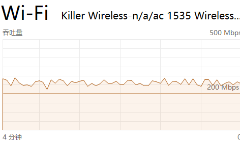

[English](README.md)   [中文](README_zh-cn.md)

# mt7915-killer
MT7915-Killer 是针对 MediaTek MT7915 (Wi-Fi 6) 芯片的深度调优驱动分支。
本项目基于 2022 年 12 月的 [openwrt/mt76](https://github.com/openwrt/mt76) 源码，集成了截至 2026 年 3 月除 WED 外的大部分补丁，并针对 MT7621 等弱核 CPU 进行了专项定制，旨在提升性能并彻底解决长期高负载下的“老化”卡顿与重启问题。

## 性能 (AP+Client)
- 基准下载速率: 连续运行 ```iperf3 -R -w 1M -P1``` 17小时后


- 重度内存回收后的恢复

  重压下的韧性（运行时间超过 15 小时）：请留意在经历一段高强度内存回收期（即 V 型下探）之后的恢复表现。驱动程序从内核限流状态无缝切换回全速运行（320 Mbps），有力地证明了 NAPI 拦截机制在传统 MIPS 架构芯片上的可靠性。

  
  
  
## 核心驱动优化 (Linux 5.4.268 验证)
- 内存策略优化：将 DMA 申请从 Order-2 降级为 Order-0 (4KB) 连续物理页，从根源规避 MIPS 架构在高带宽下因内存碎裂导致的分配延迟与 OOM。
- WIFI5 专项增强：针对 WIFI5 网卡优化 MSDU 聚合（最大 3 包），提升跨代兼容性下的稳态吞吐。
- NAPI 拦截与自旋锁修复：在 ```mt7915_poll_tx``` 清理 MCU 队列时引入 ```mcu_poll_cnt``` 计数拦截，通过“软轮询重调度”模式压制硬件中断风暴，解决自旋锁竞争引起的系统死锁。
- 资源精简：裁减 RX 队列（8->5），精简 RX/TX_RING、MCU、WTBL 等各类描述符尺寸，降低内存足迹。
- 驱动级 CPU 绑定：硬锁定 mt76-tx 工作线程至 CPU2，防止内核 IPI 调度漂移。

## 建议部署架构 (CPU亲和性)
- CPU2: 绑定硬中断 mt7915e (5G) 与 mt7915e-hif (2.4G)；运行 mt76-tx 发包聚合线程。
- CPU3: 内核自动承接 CPU2 投递的 HRTIMER 任务（利用 VPE 共享 L1 Cache 特性）。
- CPU0/1: 绑定 NAPI POLL 工作队列进程及用户态应用。

## 压测表现
在 MT7621 (1000MHz - 超频) + Killer-1535 + (PC端运行 ```iperf3 -R -w 1M -P 1```) 环境下：
- 稳定性：12 小时+ 持续稳定在 250~300Mbps。
- 自愈性：即便在高负载后期iperf3 (路由端）出现 Bad page state 隔离或内存同步回收，系统也能在分钟级内自动反弹。
- 指标：Dirty memory 保持为 0kB，NET_RX/HRTIMER 软中断分布科学，高阶内存（Order 9-10）留存健康。

**注意**

压力测试过程中，所有 napi-workq 进程以及 MT7915 驱动核心工作进程 mt76-tx 全部保持在内核默认优先级（NICENESS 0）工作。
